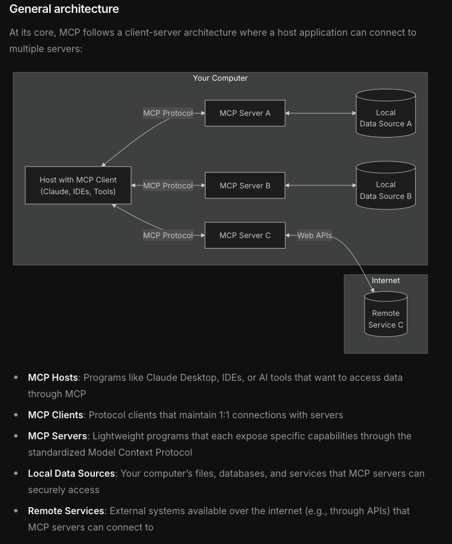

# 🚀 MCPAgent SDK & Website

**Download/Clone** this project from GitHub, or copy the files directly to your environment.

---

## 1. MCPAgent SDK (Python)

The **MCPAgent SDK** provides a high-level interface for building and interacting with **MCP**-compatible servers. It uses the [MCP Python SDK](https://pypi.org/project/mcp/) under the hood to manage resources, tools, and prompts in a standardized way.

### Installation

1. **Install MCP** from PyPI:
   ```bash
   pip install mcp
   ```

2. **Clone** this repository or copy the relevant files (e.g., `mcpagent.py`, `server_multi.py`, etc.) into your project.

### Getting Started with `MCPAgent`

Below is a snippet showing how you can incorporate the **`MCPAgent`** class in your own Python code. This class launches your MCP server in a subprocess and helps you easily call resources, tools, or prompts.

```python
from mcpagent import MCPAgent  # example import from your local file
import asyncio

async def main():
    # Point to your server script (e.g., server_multi.py)
    agent = MCPAgent("server_multi.py")
    
    # Start MCP server & initialize session
    await agent.start()

    # Interact with the server: call a resource, tool, or prompt
    info_text = await agent.read_info("Python")
    print("Resource info:", info_text)

    product = await agent.multiply(7, 8)
    print("Tool result (7*8):", product)

    prompt_messages = await agent.run_prompt("You are a powerful math Agent\nQ: give the formula of derivative of cos(x)\nA:")
    for msg in prompt_messages:
        print(f"{msg.role.upper()} - {msg.content.text}")

    # Clean up
    await agent.stop()

if __name__ == "__main__":
    asyncio.run(main())
```

### Core Features

1. **Resource Access**  
   Easily read or write contextual data via resource URIs (e.g., `myresource://...`).

2. **Tool Invocation**  
   Execute server-defined tools (functions) by name, passing in JSON arguments. Perfect for hooking into AI model logic.

3. **Prompt Usage**  
   Render or retrieve prompt templates from the server, returning them as messages for the LLM.

4. **Subprocess Integration**  
   The `MCPAgent` can spawn the MCP server script in a subprocess (via stdio), so you don’t need separate windows or manual commands.

---

## 2. MCP Website & Hosting Description

The below describes the **MCP Agents** web interface and broader context for the **Model Context Protocol**.

# 🚀 MCP Agents: The Future of AI Agent Architectures

Welcome to **MCP Agents**, a modern web interface showcasing the revolutionary **Model Context Protocol (MCP)**, the next step forward in AI agent architectures. 🌐

With **MCP**, the way AI models interact and share contexts is being transformed into a standardized, scalable, and flexible solution. This project serves as both an introduction to the protocol and a resource hub for developers. 💡

Tech-Spec: https://modelcontextprotocol.io/introduction



---

## 🤔 What is MCP?

The **Model Context Protocol (MCP)** is a cutting-edge standard for **context sharing and management** across AI models and systems. Think of it as the **language** AI agents use to interact seamlessly. 🧠✨

Here’s why **MCP** matters:

- 🧩 **Standardization**: MCP defines how context can be shared across models, enabling **interoperability**.
- ⚡ **Scalability**: It’s built to handle large-scale AI systems with high throughput.
- 🔒 **Security**: Robust authentication and fine-grained access control.
- 🌐 **Flexibility**: Works across diverse systems and AI architectures.

---

## ✨ Features of MCP Agents

- 🖼️ **Futuristic UI**: Built using **Next.js** and **Tailwind CSS**, providing a sleek and minimalistic experience.
- 📑 **Tech Docs**: Curated documentation on how to get started with MCP, from Python SDKs to server setup.
- 🗿 **Roadmap**: A visual timeline of MCP's milestones and future plans.

---

## 🚀 Getting Started

### 🔧 Prerequisites
To run the **web interface** locally, you’ll need:

- **Node.js** (v16 or higher recommended)
- **npm** or **yarn**

### 🛠️ Installation

Clone the repository and install dependencies:

```bash
git clone https://github.com/yourusername/mcp-agents.git
cd mcp-agents
npm install
```

### 🏃‍♂️ Run the Development Server

```bash
npm run dev
```

Open [http://localhost:3000](http://localhost:3000) in your browser to see the website in action! 🌟

---

## 📑 Key Sections

### 🏠 Landing Page
Learn what **MCP** is all about, with **real-world context** and **getting-started** code snippets.

### 📖 Tech Docs
Comprehensive, developer-friendly guides covering:
- 📦 MCP Python SDK installation and setup.
- ⚙️ Creating an MCP-compliant server.
- 🔧 Example workflows and integrations.

### 🗿 Roadmap
A sleek, timeline-based visualization of MCP's progress:
- ✅ **POC** and **MVP** completed.
- 🚀 Next steps: **Scalability**, **Feature Enhancements**, and **Community Building**.

---

## 💻 Tech Stack

This project is powered by:

- ⚛️ **Next.js** – A React framework for server-side rendering and static site generation.
- 🌠 **Tailwind CSS** – A utility-first CSS framework for rapid UI development.
- 💡 **react-syntax-highlighter** – Beautiful code highlighting for developers.

---

## 🤝 Contributing

We’d love your help to improve **MCP Agents**! 🛠️ Feel free to:
- Submit issues and pull requests.
- Improve documentation and examples.
- Share your feedback and suggestions.

---

## 📩 Contact

Got questions? Reach out to us via:

- **Email**: [support@mcpagents.com](mailto:support@mcpagents.com)
- **Twitter**: [@mcpagents](https://x.com/mcpagentai?s=21&t=IrGkUBzm35569bCilBv5oA)

---

Enjoy building with **MCP** and the **MCPAgent SDK**, shaping the future of AI! 🚀✨

